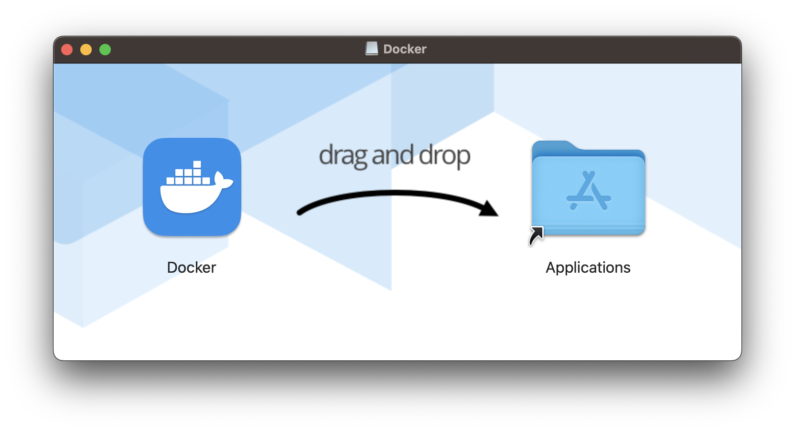
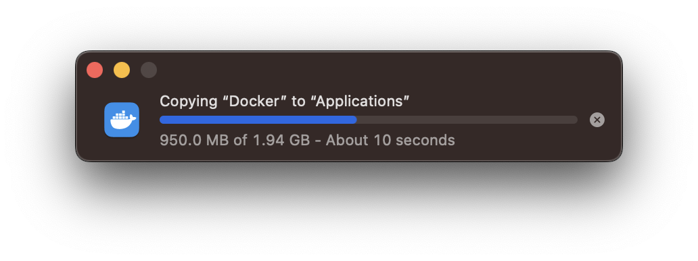
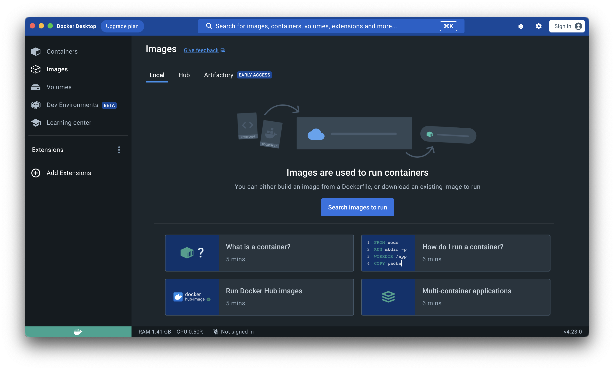
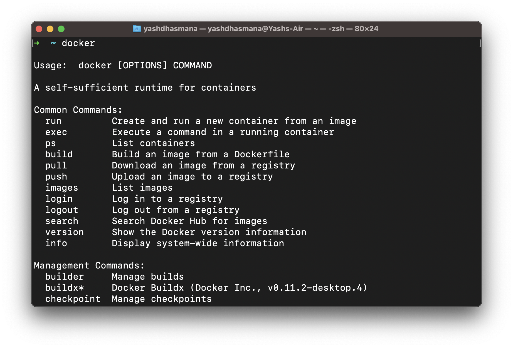

# Installation 

Downlaod your platform specific Docker Desktop from [Docker Website](https://www.docker.com) and install it.

To verify the installation, go to your terminal and type and enter "docker".

You should see an output if the installation was done correctly.

 
 
 
 