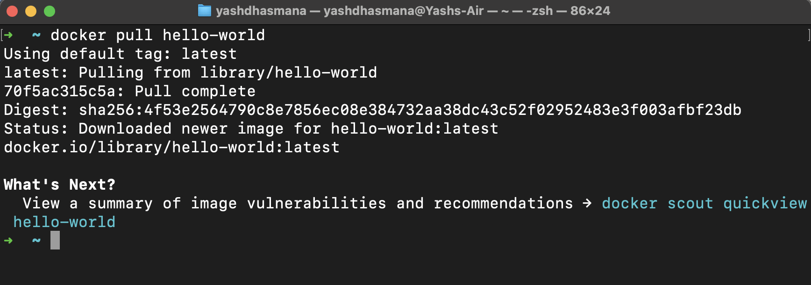
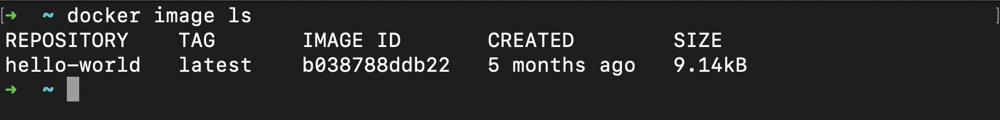
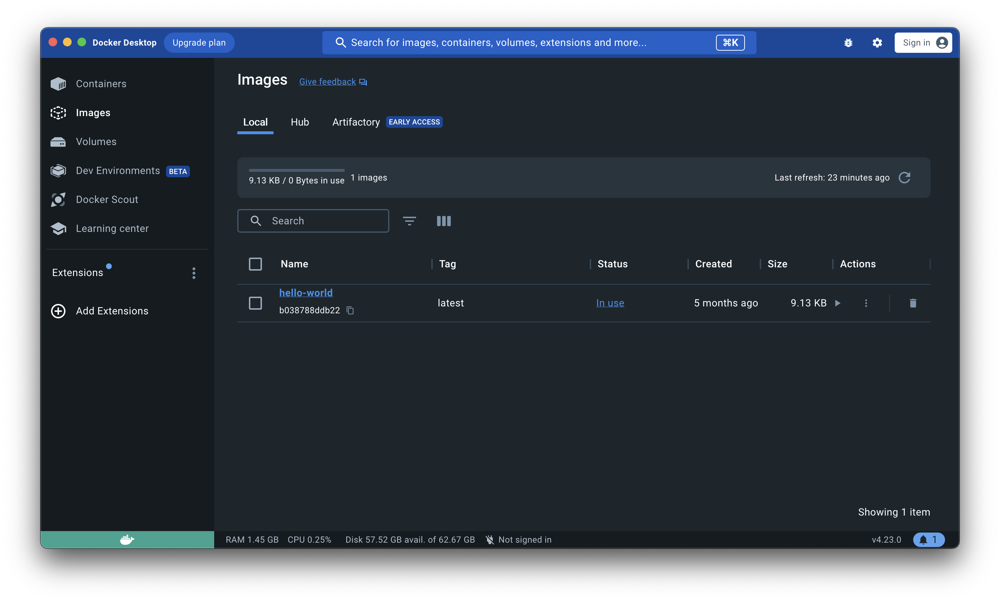
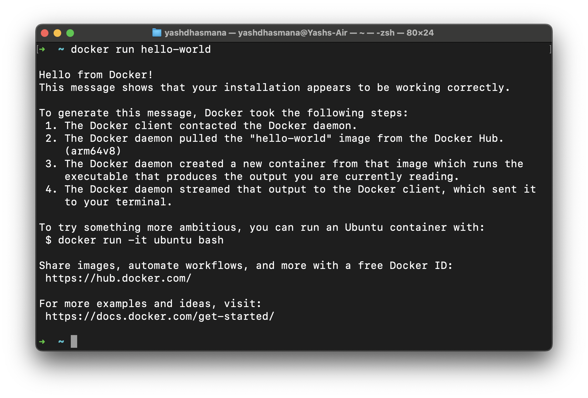

As we are now done with the basics and installation of docker, its time to run our first container from an image named hello-world.

The hello-world image is an image developed and published by docker itself and is used to verify the installation and correect working of docker. Running this container is like writing the print hello world statement in any new programming language(though docker is not a programming language, but you get the point).

To run this conatiner we first need to download this image from Docker Hub. Open your Terminal and follow these commands, make sure your docker desktop is also opened otherwise these commands will not work and show some error like "docker daemon is not running ........"

1. Download hello-world 

```
docker pull hello-world 
```



2. list all the images (optional)

```
docker image ls 
```



Additionally this would also be visible in the images section in Docker Desktop.



3. Run the image

```
docker run hello-world 
```

if you are seeing the output on running the image, everything is working correctly and as intended.




<br>
<br>
<br>
<br>